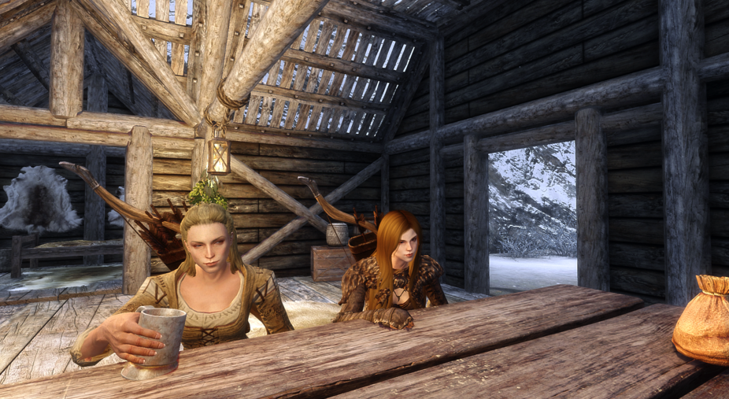

# Ice Prison

## Prologue

I'm sitting near crackling fireplace, in a warm and cozy room. Writing these lines. This is my diary, my obituary.. so to say. No, I'm not dead yet. But I will be soon. Time is running out. I have ruined everything again. All my life I just tried to survive. And yet.. Tamriel wants my blood.

I'm warm and cozy now, but I was cold and wet and freezing not so long ago. I'm a Bosmer (or a "wood elf", how the nordlings call us in their ignorance). She-elf. I was not made ready for the harsh cold climate of Skyrim. And yet here I am. I was banished from my homeland, I was persecuted, I was made to flee and I ended up on the Helgen border. It is where my story starts.

## Helgen escape

I thought I was near the Helgen border. The hills were covered in ice, there was a light snow falling in. The sky was white and cloudy. The wind was howling.. it wasn't cold.. yet. But it's going to become colder in the evening. I needed to come to Helgen.

I had some good supplies on me though. I had full set of fur clothes, so I wasn't really cold. I had another set of linen clothing for indoors. I had a good wooden bow from the Ash of Morrowind. I had a quiver. And a sword I obtained during my travels at one of the towns. However I did not have a shield. I lost it when one of my fellow travelers tried to rob me in my sleep and I needed to flee the camp again. So defending from any foes would prove a difficult venture. I had 100 ceptims on me, a torch, and some bits of food. A waterskin too.

After looking around I spotted a road coming downhill and turning to the left, around the hill I was on. I started climbing down. After a fair bit of walking I got confident I will arrive somewhere. After all, it was a road. Made by the folk of Tamriel. It should lead somewhere civilized.

After a fair bit of walking, I noticed a holdfast in a distance, through the clearing in the forest. It must've been Helgen, I thought. However something didn't seem right. Right at the moment when that thought popped into my head, I heard a loud explosion sound, as if something massive blew up. I instantly crouched and looked around: nothing that could've made this sound was visible in the vicinity of this clearing. After waiting for a while, I decided to carefully proceed towards the holdfast, to check what it is.

After I went back onto the road, another explosion boomed right in front of me: a fireball hit the ground inches in front of my face. I cowered. I turned around fast: there was a mage, throwing fireballs one after another at me! This was so unexpected I froze for a moment. But after this brief moment I understood I need to move. I tried to run, moving from side to side, avoiding his fireballs. Running through the forest so that the trees can hide me. There I found a group of boulders, down there near the holdfast, where I hid and waited. I waited for a long time. An hour passed. And fireballs ceased so I decided I was in the clear. I slowly moved away out from the boulders and proceeded down to the holdfast.

The holdfast wasn't Helgen. It had an altar at it's entrance with human skulls and bones, covered in blood, sitting right on top of it. I think it was some ritual ground for some blood mages or maniacs or other horrible things. However, I didn't see anyone around. If there was anyone home, they would surely put out the guards around the tower? So I decided to peek inside. No harm done if I could steal some good supplies or tools from them.

After I went inside and closed the door behind me, it took me a moment to adjust to the dim light. The holdfast was just a facade: a long deep tunnel adorned with human skulls were leading down into the depth of the earth. And what was even more scary: I heard steps. Steps coming from the depth. Steps becoming louder and louder. I couldn't fight the impulse to jerk the door and come back outside. Then I moved away from the tower and hasn't thought about it twice. I did make a note of it to return to it later, if I feel like it. But I didn't feel like it at the momenet at all.

So I went back into the wild. At this point I was utterly lost, so I needed to find the high ground to get some landmarks sorted out. I found a hill near a cliff and peered down into a vast exponse of mountains and forests. They stretched till the horizon, and only in the midst of it there was some river that I failed to recognize. All my maps knowledge had proved in vain. I still had no clue where should I go hither.

## Angi the archer

I went ahead down the same road I was walking. It was still heavily snowing. The weather didn't relent at all, if anything it had became worse. In a short while I almost stepped into a snowed down bear trap! I carefully examined it: it wasn't rusty, it was well done and well placed. And it was working! I tried triggering it with a stick, and then carefully reset it: whoever placed them here surely didn't want some stranger to defuse them.

I followed the trail. Carefully avoided 5 more bear traps, then I spotted wood posts with targets drawn on them, as if someone were practicing shooting with a bow. I followed these too until I spotted something resembling a house. It was a meager shack, standing on the hill overlooking this whole road. There weren't any ways to get up there but through this narrow rocky path, which was a great strategic advantage to the house owner. I also heard some humming: as if someone was using a hammer on a wood. I came closer. I hoped the owner would be friendly and I could ask him how I can reach the rearest town. Maybe he will even let me warm up..

Turned out it was she! As I came closer, I found a woman, dressed in a linen dress, hammering some nails into a plank forming the side of the house. It was clearly her home, and she lived here alone. There was a bonfire burning brightly, and some cooking pots placed around it. The woman turned to me as I approached.

Her name was Angi. She moved here from Helgen after her father was killed by two drunk imperials, and she killed them in her wrath. So now she was an outcast like me. She couldn't return to her home. She needed a new one.

We two were quite alike. I asked if I could use her fire to warm up and she proposed me soup and we sat together and discussed the recent news. It seems war has spilled into the lands of Skyrim and people were killing each other in a futile struggle. Then she proposed me to practice our bows together, so we went down to her target posts and shoot at them. I didn't have so much fun for a long while. After weeks of joyless roaming the woods and snowy hills this was a nice change. It seemed as if I had gotten my first friend on this side of the border. I wasn't going to pass up that opportunity.

I know she was all alone there, I could've probably killed her and claimed the house for myself. But I wasn't going to start my new life with this bullshit. This is exactly the type of thing why I had been cast out from my native lands...

After practice we returned back to the fireplace, warmed up, drank some ale and shared some apple cabbage soup. When she wasn't looking I peeked at her place. There was a chest there and I was just wondering what she might store there. It was unlocked. The only thing I needed to do is slowly draw out the drawer.. there was a treasure map there. I wanted so bad to just grab it. Maybe there is a lot of treasure somewhere nearby. This would help my new life by a large margin... but I decided to only make a note: if I need the money, I'll return here. I hope she won't dispose of it.

I spent a fair bit of daytime there and I still needed to reach Helgen, so it was time to part. However when I asked about Helgen, I was dismayed: it turned out some cataclysm had destroyed the town. The only thing that is left there is rubble. She told me to make for the nearest town instead. It was a Folkreath town. There was a dangerous road there though. There was an alternative, easier way she told, but I decided to try my luck.

Before I left, she gave me a gift: her family bow. She wanted it in good hands and wanted to part with it because it brought too many sad memories about her dad. So I solemnly accepted it. I gave her some flowers I gathered on my way here. They were pretty mountain flowers, and could be used it alchemy and poultices too.

As I got down the weather improved, birds started chirping around me. The mood lightened. I could already see myself striding into the town.. but then suddenly I saw a figure ahead of me. A hooded man. He held his hands up and I startled, failing to move, as powerful lightning shot down from his hands and killed me on spot.

> I'm DEAD

That was an ending for another time, but truly at that moment when I was leaving, I thought that Falkreath way migth be too dangerous for me. So I asked Angi the directions to the other, easier to reach town. It was Riverwood, a village near Helgen. To get there I would need to go almost all the way back to the Helgen border, but just before the road crossing to turn left, downwards from the hills into the forest.

I asked her about the mage who were throwing fireballs too. I was afraid he was still there. But Angi didn't know anything about the mage.

## Road to Riverwood

I went on back quietly. Past the archer posts, past the bear traps, up the hill past the ritualistic holdfast. From there on, I started being careful as I could. I knew the fireball mage might still be here somewhere. I crawled around the hills, hiding behind trees, trying to avoid the main road, until I reached the Helgen border.. and understood that I'm lost again. I should've seen the road branch out to the left way before the border, I thought. Exasperated, I started back. Trying to reach for the road, leaning towards the downhill slope, until I found a short trail leading down, and took it.

It took me a fair bit of time getting down there, because you see, I'm a wood elf, and I feel a special desire to gather all the herbs and stalks and mushrooms. I liked to dabble with the alchemy too, so that was going to be my way of making money as well. I needed all these herbs and took my time gathering them all on my way.

And then I needed to leave my bow. Right there in the woods. I buried it deep so I might return and get it. Carrying two bows was too much of a hussle, and I couldn't manage it with all these herbs in my herb bag. It was getting cumbersome. And I couldn't just throw away Angi's bow: I felt like I owe to give this bow a life now, so I kept it instead of my own.

As I went on, the weather changed. Instead of heavy snow it started raining, just pouring own like it's the end of the world. And at this moment, finally, I reached Riverwood! The gate was closed though, and I always thought that Riverwood was a village, too small for gates. But here it stood, a large wooden gate, looming above me. And no guards. Something felt wrong.

I thought I was saved, I would come into the tavern now and dry and warm up and eat and rest. And then I pried open the heavy creaking wooden door and gasped: everything was scorched, fires were burning everyowhere, rubble and death all around me. It wasn't Riverwood: it was Helgen.

## Helgen's welcome